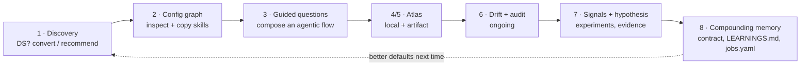

# The client setup journey — tracked

## 0. TL;DR

You described an 8-stage loop, not a linear onboarding — it starts at "do you have a design system"
and ends at "automated growth machines," but the last stage feeds back into the first (better
skills, better recommendations, next client). Mapped against what's actually on disk, **the two ends
of the loop (discovery/setup and the signal/hypothesis loop) are the most mature; the middle
(guided flow-building from skills, the graph's copy-to-portable-skill UX) is where the real net-new
work is.**

| Stage | What you described | Status |
|---|---|---|
| 1 | Discovery: have a DS? convert / decide use cases / recommend | 🟡 partial — detection + conversion exist as separate pieces; no unified recommendation step |
| 2 | 3D graph inspector, legend, easy skill copy | 🟢 mostly built — legend exists, copy exists but copies only the command name |
| 3 | Guided questions → compose skills into an agentic flow | 🔴 net-new |
| 4 | Display the local Atlas | 🟢 built (gated, ADR-010 Layer 3) |
| 5 | Same, rendered via artifact / "a better way" | 🟡 designed, not built — resolved in the execution-plan doc |
| 6 | Drift report, audit | 🟢 built |
| 7 | Signal attach (PostHog), hypothesis, experiments, growth automation | 🟢 built — the most mature part of the loop |
| 8 | Compounding knowledge, long-term automation | 🟢 architecturally real (not aspirational) — see §8 |

## 1. Discovery & setup decision

**What you asked for:** "do I have a design system already? convert, decide use cases, recommend."

**What exists today:**
- Detection/audit: `npx systemix audit` → `/design-audit` — zero-setup, infers the de-facto DS,
  flags drift, proposes a starter `design/` (`packages/cli/src/commands/audit.js`).
- Conversion: `scripts/token-converter.ts` (globals.css → tokens.bridge.json) and
  `scripts/generate-design-md.ts` (contract → DESIGN.md) — the mechanics of turning an existing
  system into Systemix's format exist, but as separate scripts, not one guided path.
- "Decide use cases": the **already-locked** `npx systemix init` 4-question wizard (ADR-008) —
  Surfaces / Signals / Autonomy / Self-improvement → `systemix.config.yaml`. This *is* the
  use-case-selection step, already decided, already shipping.
- Adopt-vs-scaffold: `systemix.config.yaml` already has the seam for this —
  ADR-015 names `design.source` as the pointer to an existing DS ("scaffolded, pointed at an
  existing DS, or omitted"). This instance's own `systemix.config.yaml` doesn't set it, but the
  field is designed in.

**What's missing — the "recommend" part.** Today `/design-audit` reports findings; the 4-question
wizard asks fixed questions; nothing sits between them making a judgment call. Concretely missing:
a **discovery pass that feeds defaults into the existing wizard** rather than replacing it —
run `/design-audit` first, classify the result (no DS detected → scaffold fresh · partial/inconsistent
DS → convert + consolidate · mature DS → adopt via `design.source`, wire drift-only), and pre-fill
the 4 questions with a recommended answer the operator can accept or override. This is additive to
ADR-008, not a reopening of it — the wizard's questions are unchanged, only pre-filled.

## 2. Config — the 3D graph inspector, legend, skill copy

**What exists today (ADR-021/022):** the node-centric Config graph, a `Legend` component, and a
`NodeCard` inspector (`src/components/graph/NodeCardPanel.tsx`) that already has a `CopyButton` for
skill nodes — but it copies **only `node.label`** (the slash-command name, e.g. `/drift-report`),
not the skill's actual definition.

**The gap, concretely:** "easy copy of skills" should mean walking away with something usable
elsewhere — the skill's full markdown body (trigger description + instructions), not just its
invocation string. Two small, well-scoped additions to `NodeCardPanel.tsx`:
1. `CopyButton` on a skill node copies the resolved `.claude/skills/<name>/SKILL.md` (or the
   pipeline-manifest equivalent) contents, not just the label.
2. A secondary action — "copy as reference" — copies a short attach-to-context snippet (path +
   one-line description), for dropping into a *different* project's `CLAUDE.md` or context window,
   distinct from copying the full body.

Everything else about this stage (orbit/pan/zoom, node-info panel, dimming inactive nodes, the
7-type taxonomy) is already built and doesn't need rework — this is a scoped UX addition, not a
new surface.

## 3. Guided questions → compose skills into an agentic flow (net-new)

This is the actual gap in the middle of the loop. What you're describing is a **workflow builder**:
select/copy skills from the graph (§2), answer a short guided sequence (trigger? persona/surface?
step order? which steps need HITL? parallel or sequential?), and get back a saved workflow.

**Why this is cheaper than it sounds — the storage and rendering already exist:**
- `PersistedWorkflow` (`src/lib/workflow/persistence.ts`) already defines the shape: `id`, `name`,
  `steps: WorkflowStep[]`, `tags`, versioned, file-backed at `.systemix/workflows/*.json`.
- `POST /api/workflows` (`src/app/api/workflows/route.ts`) already saves one.
- The step-type vocabulary is already fixed (`app-three-layers.md`): Input · Agent reasoning ·
  Router · Parallel coordinator · Tool call · HITL · Output — Atlas already renders these.

**What's new:** the guided-question skill itself (`/build-workflow` or similar) that turns a
conversation into a `WorkflowStep[]` array conforming to that existing schema, then calls the
existing save path. No new storage, no new rendering — a new *authoring* skill in front of
infrastructure that's already there.

## 4 + 5. Displaying Atlas — local app and artifact, side by side

Resolved in `docs/systemix-productization-execution-plan-2026-07.md` §1 — restated here because it's
load-bearing for this journey:

- **Local (ADR-010 Layer 3):** the full ReactFlow Atlas, gated until `init` is complete and a DS is
  synced. This is where a freshly-built workflow (§3) is best reviewed in full fidelity.
- **Artifact (new, designed not built):** a Cowork live-artifact with a hand-rolled inline SVG/DOM
  renderer, two-tier data fetch (`localhost:3001/api/workflows` → MCP `list_workflows` fallback),
  click-to-detail-pane. This is the portable/no-dev-server-required path — useful for sharing a
  workflow with someone who doesn't have the repo open, or as the lighter-weight default view.

Not a replacement of one by the other — the local app is full-fidelity/editing, the artifact is
portable/viewing. §0 of the execution-plan doc flags the one open technical assumption (does the
artifact sandbox allow a localhost fetch) as the first thing to verify.

## 6. Drift report, audit — already built, ongoing

`/drift-report` (OKLCH perceptual diff, ADR-002) and `/design-audit` (`npx systemix audit`) already
do this. Nothing new required for this stage; it's the maintenance heartbeat that runs continuously
once §1–5 are done once. Its output (drift status per token/component) is also one of the three
ingredients in the paid Readiness Audit artifact from the productization-benchmark doc.

## 7. Signal attachment, hypothesis, experiments, growth automation

**This is the most mature stage of the whole journey — already substantially built:**
- Signal wiring: `/connect-signal` (ADR-020) — guided PostHog wiring, verified via
  `systemix evidence check`, with an honest unconfigured state (no dishonest silent failures) and a
  `type:` taxonomy (`wired` / `mcp` / `manual` — ADR-021) so non-API signals like LinkedIn engagement
  are first-class, not a degraded fallback.
- Hypothesis/experiment loop: `/hypothesis` → `/measure` → `/experiment` → `/evidence` → `/hermes`,
  binding to the **consuming app**, not the DS package (ADR-009) — keeps analytics credentials out of
  a published design-system package, a real compliance boundary (relevant again for an ESG/regtech
  client).
- The node card (§2) already surfaces per-source state (connected / no-signal / manual-log) inline,
  so "growth automation" isn't a separate dashboard — it's the same graph, same inspector, different
  node types lighting up as evidence flows in.

Nothing net-new identified here; this stage validates the rest of the journey rather than needing
new build.

## 8. The compounding-knowledge meta-loop

Where "compound knowledge and long-term automation" concretely lives today, not just as a pitch:
- `contract/**/*.mdx` — the per-unit source-of-record (ADR-015/019); every decision carries its
  rationale forward, read by the next `/component` or `/generate` call.
- `experiments/LEARNINGS.md` — the synthesized memory Hermes writes to.
- `docs/product/jobs.yaml` — the JTBD file's own changelog is the clearest existing proof this
  already works in practice: JOB-002/003/004/007 went from `candidate-unvalidated` to
  `validated-conditional` because the **Connecta engagement produced evidence that got written back**
  (the 1.2.0 changelog entry names exactly which build artifacts validated which job). That's the
  loop closing on itself, already observed once — the mechanism this whole journey is trying to make
  repeatable for every next client.

## 9. End-to-end, as a loop (not a line)

## 10. Build order suggestion

Given the status column in §0, the honest sequencing is: **§3 (workflow builder) and §5 (Atlas
artifact) are the only real net-new engineering; §1's recommendation layer and §2's copy upgrade are
small additions; §4/6/7/8 need no new build to function today.** That argues for prioritizing §3
first — it's the one piece that, once built, makes §1's discovery pass and §2's graph genuinely
generative (you go from "here's your topology" to "here's a working flow") instead of just
diagnostic.
